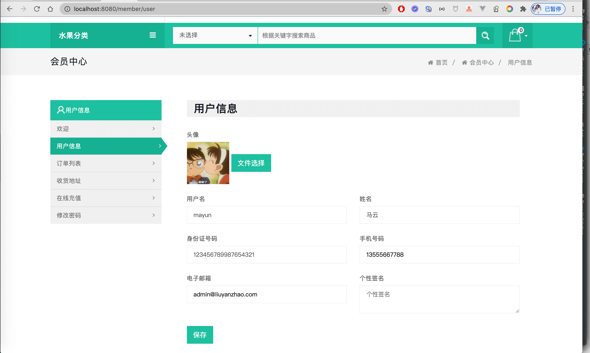
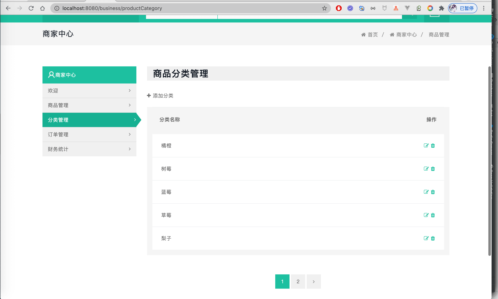
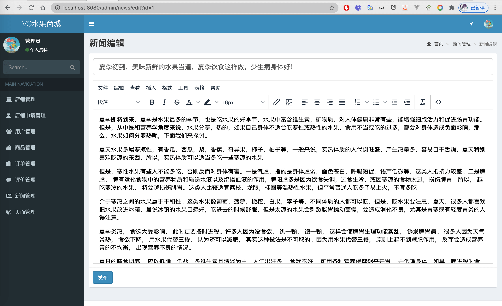

# 商城系统
基于SpringBoot实现的C2C水果商城系统。 
用户既可以作为会员买东西，也可以申请开店卖东西，类似淘宝。 
预览地址：[https://fruit.liuyanzhao.com](https://fruit.liuyanzhao.com)  
详细介绍地址：[2021原创 SpringBoot 的C2C水果商城系统](https://liuyanzhao.com/shop/1353566462320709633.html)  

# 功能介绍
- 前台功能
    1. 注册、登录、找回密码
    2. 首页，商品列表，详情详情，商品搜索，店铺主页
    3. 新闻动态
    4. 联系我们，其他详情页面
    
- 会员子系统
    1. 购物车，结算
    2. 用户信息修改，密码修改
    3. 订单管理，支付，查看物流信息，确认收货，评价
    4. 收货地址管理
    5. 申请开店，查看申请记录
    6. 在线充值
    
    
- 商家子系统
    1. 商品管理
    2. 分类管理
    3. 订单管理，发货，查看物流信息，查看评价
    4. 财务统计

- 管理员子系统
    1. 店铺管理
    2. 店铺申请管理
    3. 用户管理
    4. 商品管理
    5. 订单管理
    6. 评价管理
    7. 新闻管理
    8. 页面管理
    9. 修改个人信息和密码

# 技术组成
- SpringBoot 2.x
- MyBatis Plus
- Thymeleaf
- Bootstrap
- MySQL 5.6 或 8.0
- Maven 3.5+

# 项目预览
## 1. 前台(匿名用户页面)

## 2. 会员子系统

## 3. 商家子系统

## 4. 管理员子系统

# 联系方式
目前代码已经开发完成，暂时不完全开源，预计暑期会后端开源。 
现在需要完整代码，请联系博主微信 847064370
